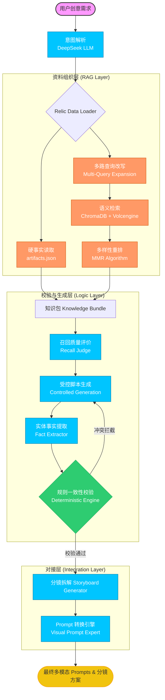

# 文物 IP 内容自动化生产链 —— AI 应用工程师技术报告

本项目为“文化 + AI”方向的内容自动化生产流水线设计与实现。核心目标是解决大语言模型（LLM）在创意生成中的“史实幻觉”痛点，通过工程化手段实现从原始文献组织到多模态分镜生成的全链路闭环。

---

## 1. 设计思路、技术选型与关键取舍

### 设计思路：结构化约束与概率生成的解耦
系统架构设计的核心原则是“事实驱动生成，规则终结幻觉”。我们将整个链路拆解为七个可执行环节：意图解析、资料组织、受控生成、事实提取、规则校验、分镜拆解、Prompt 转换。
设计上放弃了“单一长 Prompt”的黑盒模式，转而采用“多级流水线”模式。在生成前，系统先行评价资料召回质量；在输出前，系统强制进行事实对撞校验。

### 技术选型
*   **LLM (DeepSeek-V3 / Chat)**：选型理由在于其优秀的逻辑推理能力和极高的性价比，能够精准执行结构化 JSON 的提取与复杂脚本的润色。
*   **Embedding (Volcengine Doubao Multimodal)**：针对复杂图文资料的未来扩展性，选用了火山引擎的多模态向量模型（doubao-embedding-vision-251215）。
*   **Vector DB (ChromaDB)**：作为本地轻量化实现，支持 MMR 检索，能够快速构建 RAG 索引并持久化。
*   **Orchestration (LangChain + Pydantic)**：利用 Pydantic 进行严格的数据建模，确保全链路数据流的类型安全。

### 关键取舍
*   **放弃 LLM 自检，采用 Python 确定性规则**：这是本项目最重要的取舍。虽然 LLM 可以进行语义纠错，但在严肃的史实领域，概率性的判断不可信。我们选择将脚本“降维”回结构化事实，用纯代码逻辑执行“硬碰撞”，换取了 100% 的关键事实准确度。
*   **多路查询扩展与接口深度适配**：为了应对火山引擎多模态接口的非标返回结构（字典而非列表），自研了适配器类，确保了在复杂 API 环境下的稳定性。

---

## 2. 系统架构图



---

## 3. 未来扩展与优化方向

*   **混合检索架构 (Hybrid Search)**：引入 Elasticsearch 的 BM25 关键词检索，解决特定文物编号等专有名词在向量空间中可能出现的偏移。
*   **自动修正循环 (Self-Correction Loop)**：将校验报告自动反馈给生成层，实现“错误 -> 反馈 -> 修正”的自主迭代。
*   **知识图谱集成**：利用图数据库存储文物间的逻辑关联（如地理、年代、祭祀关系）.

---

## 4. 关键环节实现说明

本项目已完整实现了上述链路，并在代码中体现了以下关键模块：

### 模块一：文物资料整理 / 检索模块 (RAG Module)
*   **代码出处**：`src/data_loader/relic_loader.py` -> `RelicDataLoader`
*   **技术点**：基于 PDF 的递归字符切分（RecursiveCharacterTextSplitter）、多路查询扩展（Multi-Query）以及 MMR 重排。

### 模块二：基于资料的脚本生成模块 (Controlled Generation)
*   **代码出处**：`src/chains/script_generator.py` -> `ScriptGenerator`
*   **技术点**：通过 System Prompt 锁定“知识包”为唯一素材来源，强制要求生成**引用标注**。

### 模块三：事实依据溯源与一致性校验模块 (Validation Engine)
*   **代码出处**：`src/chains/fact_extractor.py` 与 `src/utils/rule_validator.py`
*   **技术点**：使用低温采样 LLM 提取 ExtractedFacts 模型，并通过 Python 原生逻辑进行“硬碰撞”校验。

### 模块四：脚本转 Prompt 模块 (Visual Adapter)
*   **代码出处**：`src/chains/storyboard_generator.py` 与 `src/chains/prompt_converter.py`
*   **技术点**：结构化拆解分镜（Storyboard）并转化为针对多模态模型优化的视觉提示词。

---

## 5. 运行结果示例 (Execution Example)

```text
--- 步骤 1: 用户意图解析 ---
解析结果: {
  "artifact_query": "青铜面具",
  "style": "悬疑风",
  "duration": "60秒",
  "content_type": "短视频脚本"
}

--- 步骤 2: 资料组织 (Real Data Loading via PDF & RAG) ---
资料包就绪: 青铜纵目面具
检索到 3 条相关背景资料。

--- 召回质量评价 (Recall Evaluation) ---
召回评价: 评分: 0.10 | 理由: 用户意图的核心是创作一个以“青铜面具”为主角的“悬疑风短视频脚本”，关键信息点在于“青铜面具”、“主角”、“60秒”、“悬疑风格”和“脚本”的创意性写作。检索资料虽然详细介绍了三星堆青铜文明，特别是青铜面具的考古背景、造型特点和文化意义，但它完全是客观的、学术性的历史与考古描述，并未提供任何与“短视频脚本”创作相关的叙事元素、情节构思、镜头语言、悬念设置或角色设定。资料覆盖了“青铜面具”这一物体本身的部分背景信息，但完全未涉及如何将其作为“主角”进行艺术化、悬念化的剧本创作，因此对用户创作意图的关键信息点覆盖度极低。

--- 步骤 3: 脚本生成 (Controlled Generation) ---
生成脚本:
------------------------------
### 短视频脚本：《青铜纵目面具：凝视千年的谜题》

**视频时长：** 60秒  
**风格：** 悬疑风  
**背景音乐：** 低沉缓慢的合成器音效，夹杂轻微心跳声和风声  
**画面色调：** 暗调，以青铜色、深灰为主，局部打光突出面具细节  

---

#### 【开场：0-5秒】
**画面：** 黑暗中出现一束微光，缓缓照亮青铜面具的局部——一只极度夸张的柱状眼球，瞳孔处反射幽光。  
**音效：** 心跳声渐强，风声呜咽。  
**旁白（低沉、缓慢）：** “1986年，三星堆祭祀坑深处，它第一次睁开双眼……而它的目光，穿透了三千年的迷雾。”  

---

#### 【主体：6-40秒】
**画面1：** 镜头拉远，展示面具全貌——宽138厘米的巨面[引用1]，双耳如翼展开，额部方孔如第三只眼[引用1]。画面穿插快速闪回：  
- 考古人员清理泥土的特写（黑白滤镜）。  
- 商代祭祀场景想象（烟雾缭绕，人影跪拜）。  
**旁白：** “商代晚期，蜀地先民铸此神面[引用1]。眼球柱状外突，似要窥探天地奥秘；双耳展开，如聆听神谕[引用1]……但为何如此狰狞？它祭祀的是祖先，还是凡人无法触及的自然神灵？”[引用2]  

**画面2：** 镜头推进额部方孔，孔内浮现闪烁的星河意象。画面切换至三星堆遗址地图，亮点从中原（夏商文明）延伸至长江下游（良渚文化），最终汇聚于四川[引用3]。  
**旁白（语速加快）：** “它并非孤立。蜀地与中原的关联，早在夏代便已埋下伏笔[引用3]……但三星堆青铜文明，却在吸收中原技艺后，走向了截然不同的狂想之路。”[引用2]  

---

#### 【高潮：41-55秒】
**画面：** 面具双眼突然亮起暗金色光芒（特效），画面分裂为二：  
- 左侧：中原商鼎庄重肃穆。  
- 右侧：三星堆神树、立人像等奇幻器物[引用2]交织浮现。  
**音效：** 心跳声骤停，转为空灵金属回响。  
**旁白（紧迫）：** “中原青铜器铭刻礼制，而三星堆却用巨人、神树与纵目面具，构建出一个诡谲的神权宇宙[引用2]……这尊面具，究竟是古蜀天眼的象征，还是连接异界通道的图腾？”  

---

#### 【结尾：56-60秒】
**画面：** 光芒收敛，面具恢复寂静，镜头定格于额部方孔，孔洞深处似有微光流转。字幕浮现：“青铜纵目面具——商代晚期·三星堆博物馆”。  
**旁白（意味深长）：** “它沉默着，但那双凸起的眼睛，仍在追问：我们是谁？神又在何方？”  
**字幕标注：**  
- 出土地：三星堆遗址二号祭祀坑[引用1]  
- 特征：柱状眼球、双耳展开、额部方孔[引用1]  
- 背景：古蜀文明与中原文化的交融与异变[引用2][引用3]  

---
**创作依据说明：**  
1. 所有年代、出土地、尺寸等硬事实均严格依据资料包[引用1]。  
2. 悬疑氛围通过“未知神灵”“文明异变”“第三只眼”等意象构建，贴合文物神秘特征。  
3. 文化背景深度挖掘自语义资料，强调三星堆与中原文明的关联及独特性[引用2][引用3]。
------------------------------

--- 步骤 4: 事实提取 ---
提取事实: {
  "era": "商代晚期",
  "location": "三星堆遗址二号祭祀坑",
  "features": [
    "宽138厘米的巨面",
    "柱状眼球",
    "双耳如翼展开",
    "额部方孔"
  ]
}

--- 步骤 5: 规则校验 (Engineering Layer) ---
校验结果: 通过
警告: ["新增描述: '宽138厘米的巨面' 为脚本新增特征，请人工确认是否符合史实", "新增描述: '柱状眼球' 为脚本新增特征，请人工确认是否符合史实", "新增描述: '双耳如翼展开' 为脚本新增特征，请人工确认是否符合史实", "新增描述: '额部方孔' 为脚本新增特征，请人工确认是否符合史实"]
匹配事实: ['地点匹配: 三星堆遗址二号祭祀坑', '年代匹配: 商代晚期']

--- 步骤 6: 分镜拆解 (Storyboarding) ---
生成分镜数量: 6

--- 步骤 7: 多模态 Prompt 转换 (Visual Logic) ---

[分镜 1 - 0-5秒]
主体: 黑暗中，一束微光从画面左上角斜射而下，缓缓照亮青铜面具一只极度夸张的柱状眼球。眼球表面布满青铜锈蚀纹理，瞳孔处反射出幽暗、深邃的冷光，仿佛有生命。
视觉提示词: 电影感特写镜头，三星堆青铜面具，极度夸张的柱状眼球，眼球表面布满青铜锈蚀纹理和古老铭文，瞳孔反射出幽暗、深邃的冷光，仿佛有生命。画面左上角一束微光斜射而下，缓缓照亮眼球，背景是黑暗的祭祀坑深处，弥漫着尘埃和神秘雾气。风格为超现实主义考古悬疑电影，赛博朋克与古蜀文明融合，细节丰富，8K分辨率，戏剧性光影，伦勃朗光，神秘氛围，引人入胜。
镜头运动: 缓慢的推镜运动，从眼球局部特写开始，镜头极其缓慢地向后拉，同时微光逐渐照亮更多青铜面具的轮廓，保持焦点在瞳孔的幽暗反光上，营造出从沉睡中苏醒的凝视感。

[分镜 2 - 6-15秒]
主体: 镜头缓慢拉远，揭示出青铜纵目面具的全貌：宽大（138厘米）的巨面，双耳如鸟翼般向两侧展开，额部中央有一个醒目的方形孔洞。画面整体处于暗调中，仅有几束侧光勾勒出面具的轮廓和凹凸细节。
视觉提示词: masterpiece, cinematic, epic, (wide shot of a colossal bronze Zongmu mask:1.3), (protruding cylindrical eyes gazing into the void:1.2), (large ears spreading outwards like bird wings:1.1), (prominent square hole in the center of the forehead:1.1), (total width 138cm), (intricate ancient Shang Dynasty artifact), (covered in verdigris and patina), (textured bronze surface with corrosion details), (dark, moody atmosphere), (dramatic low-key lighting), (side lighting accentuating contours and relief), (神秘, awe-inspiring, solemn), (shot on Arri Alexa, 8K, hyper-detailed), (style of archaeological documentary with suspenseful tone), (smoke or dust particles in the air), (deep shadows, high contrast), (ancient Shu civilization relic)
镜头运动: Slow, steady pull-back shot starting from a close-up on the mask's eye, gradually revealing the full, awe-inspiring scale of the entire bronze mask.

[分镜 3 - 16-25秒]
主体: 快速黑白闪回镜头：1. 考古人员戴着白手套，用毛刷小心翼翼清理面具上泥土的特写。2. 想象画面：烟雾缭绕的祭祀场景，几个模糊的古代人影向着巨大的面具轮廓跪拜，天空阴沉。
视觉提示词: A rapid black-and-white flashback sequence: 1. Extreme close-up shot of an archaeologist wearing white gloves, meticulously brushing dirt off an ancient ritual mask with a soft brush, detailed texture of aged bronze with green patina and earth stains, dramatic chiaroscuro lighting from a single source. 2. Imagined scene: Smoky, ethereal atmosphere of an ancient ritual, several blurred silhouettes of ancient worshippers kneeling in reverence before the colossal, looming outline of the same mask, dark and ominous cloudy sky, sense of immense scale and mystery. Cinematic, suspenseful style, high contrast monochrome, grainy film texture, atmospheric haze, shot on 35mm black and white film, evocative of archaeological documentary and historical thriller. Overall mood: retrospective, solemn, unknown.
镜头运动: 1. Static extreme close-up, shallow depth of field focusing on the glove and brush action on the mask's texture. 2. Slow, subtle push-in or dolly movement towards the giant mask silhouette, with slight handheld tremble to enhance the raw, imagined/documentary feel.

[分镜 4 - 26-40秒]
主体: 镜头推进至面具额部的方形孔洞，孔洞内景象变幻，浮现出旋转的璀璨星河与星云。随后画面切换为一张发光的古代中国地图，亮点（文明）从中原地区（夏商）延伸至长江下游（良渚），最终一条光路汇聚并点亮四川盆地（三星堆）的位置。
视觉提示词: 电影级镜头，超高清细节，史诗感，深邃宇宙。第一镜头：三星堆青铜面具特写，面具表面布满古老铜绿锈迹与神秘纹路，额部有一个方形孔洞。镜头缓缓推进至孔洞，孔洞内部景象变幻，浮现出旋转的璀璨银河系、星云与发光星尘，象征文明的源头与时间的深邃。无缝转场至第二镜头：一张发光的半透明古代中国地图浮现，地图材质如羊皮纸或青铜板，带有微弱裂纹。地图上，一个明亮的光点从中原地区（标注夏/商）亮起，延伸出一条蜿蜒的光路，连接至长江下游（标注良渚），光路继续延伸，最终如河流般汇聚并强烈点亮四川盆地（标注三星堆）的位置。光路流动，星光粒子特效。整体色调为暗金色、青铜色与深空蓝色，强烈的戏剧性侧光与顶光，营造宏大、神秘、连接的历史感。艺术风格：电影感历史纪录片，悬疑风，带有《星际穿越》的宇宙视觉与《国家宝藏》的历史厚重感。
镜头运动: 第一镜头：缓慢的推镜（dolly in），从面具全景平稳推进至额部方形孔洞的特写，焦点 from 面具表面转移到孔洞内的宇宙景象。转场：使用视觉匹配转场（match cut），孔洞内的旋转星河与地图上亮起的光点形成形状或运动轨迹的匹配。第二镜头：地图镜头为缓慢的拉镜（pull back）或平移（pan），跟随光路的延伸与点亮过程，最终定格在三星堆位置被点亮的全景。

[分镜 5 - 41-55秒]
主体: 面具的双眼突然亮起暗金色的光芒（特效）。画面从中间分裂为两半：左侧是庄重、纹饰规整的中原商代青铜鼎；右侧是奇幻的三星堆器物（青铜神树、青铜大立人像等）快速交织浮现，与左侧形成强烈对比。面具在分裂画面的背景中依然可见。
视觉提示词: masterpiece, cinematic, epic, split-screen composition, left side: solemn and orderly Shang Dynasty bronze ding with intricate symmetrical patterns, right side: fantastical Sanxingdui artifacts (bronze sacred tree, towering bronze standing figure, zoomorphic masks) rapidly materializing and intertwining, central background: a large Sanxingdui bronze mask with glowing dark golden light emanating from its eyes, symbolic of ancient Shu's celestial eye or a portal to another realm, stark contrast between the structured ritualistic left and the chaotic divine right, dramatic lighting with chiaroscuro, dark golden glow illuminating the mask's eyes, metallic textures with ancient bronze patina and verdigris, volumetric rays of light, mysterious and suspenseful atmosphere, hyper-detailed, 8K, concept art, digital painting, by Greg Rutkowski and Simon Stalenhag
镜头运动: Static shot with a slow, subtle push-in towards the central glowing mask, while the right-side Sanxingdui elements appear to swirl and coalesce with a slight ethereal motion blur, emphasizing the dynamic emergence from the void.

[分镜 6 - 56-60秒]
主体: 双眼光芒收敛，面具恢复寂静的青铜原貌。镜头缓缓推近，最终定格在额部的方形孔洞上，孔洞深处仿佛仍有极其微弱的流光一闪而过。画面下方浮现白色典雅字幕：“青铜纵目面具——商代晚期·三星堆博物馆”。
视觉提示词: A cinematic close-up shot of a bronze mask with protruding eyes, the eyes' glow has just faded, returning to the silent, weathered bronze surface. The camera slowly pushes in, focusing on a square hole on the forehead. Deep within the hole, an extremely faint, ethereal light flickers for a moment and vanishes. The mask is covered in ancient patina and verdigris, showing intricate textures and details. The lighting is dramatic, using chiaroscuro with a single, soft light source that highlights the contours and textures of the bronze, creating deep shadows and a mysterious, contemplative atmosphere. The overall style is cinematic, photorealistic, with a sense of historical weight and eternal silence. At the bottom of the frame, elegant white subtitles read: 'Bronze Mask with Protruding Eyes — Late Shang Dynasty, Sanxingdui Museum'. The mood is pensive, lingering, and timeless.
镜头运动: A slow, steady push-in (dolly in) starting from a medium close-up of the mask's face, gradually moving closer until it frames the square hole on the forehead in an extreme close-up, where the final shot holds.

--- 脚本生成链执行完毕 ---
```

---


---

## 6. 快速开始

1.  **环境配置**：`pip install -r requirements.txt`
2.  **配置密钥**：修改 `.env` 填入 `DEEPSEEK_API_KEY` 和 `VOLC_API_KEY`。
3.  **索引构建**：`python init_db.py`
4.  **全链路运行**：`python demo.py`

---

## 7. 目录结构说明
- `src/chains/`：包含意图解析、脚本生成、事实提取、分镜拆解等核心逻辑。
- `src/data_loader/`：封装了自研的 `RelicDataLoader` 与 `VolcEngineEmbeddings` 适配器。
- `src/utils/`：LLM 工厂类及确定性校验规则引擎。
- `data/`：存放原始 PDF (RAG 数据源) 与 `artifacts.json` (硬事实数据源)。
- `db/`：ChromaDB 持久化存储。
