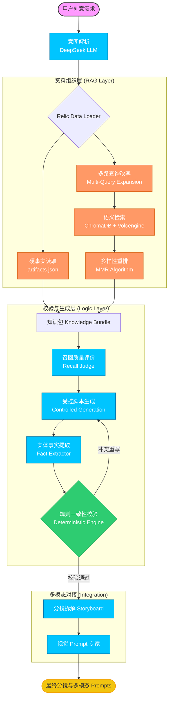

# 文物 IP 内容自动化生产链 —— 工程化 RAG 与去幻觉方案

本项目是针对“文化 + AI”方向设计的**内容自动化生产流水线**。核心目标是解决大语言模型（LLM）在创意生成中的“史实幻觉”痛点，通过工程化手段实现从原始文献组织到多模态分镜生成的全链路自动化。

---

##  核心设计哲学

1.  **事实与创意解耦**：LLM 仅作为“语言组织者”，事实来源被外挂在向量库和结构化 JSON 中。
2.  **验证与生成解耦**：生成过程允许中温采样以保证创意，但验证过程采用 Python 确定性逻辑（Single Source of Truth），确保史实零差错。
3.  **闭环反馈机制**：通过“提取-对撞-拦截”机制，实现从“黑盒生成”到“白盒监控”的转变。

---

##  系统架构

### 全链路生产流程 (7-Step Pipeline)



---

##  关键技术细节

### 1. 深度检索优化 (RAG Optimization)
*   **多路查询改写 (Multi-Query Expansion)**：系统自动将用户查询扩展为“背景”、“特征”、“文化关联”等维度，极大提升了从海量 PDF 文献中检索相关信息的**召回率 (Recall Rate)**。
*   **MMR 重排算法 (Max Marginal Relevance)**：在向量搜索中平衡相关性与多样性，强制选取互补的文本片段，避免 LLM 上下文出现冗余。
*   **自适应 API 适配器**：针对火山引擎 `doubao-embedding-vision` 多模态模型的特殊接口（`/embeddings/multimodal`），自研了 `VolcEngineEmbeddings` 适配类，处理其非标准的输入结构与 JSON 响应。

### 2. 自动化一致性引擎 (Consistency Engine)
*   **确定性校验**：放弃 LLM 自检，改用 Python 逻辑。通过 `FactExtractor` 提取分镜实体，并与底座数据库（Single Source of Truth）进行对撞，强制约束年代、地点等关键硬事实。
*   **Recall Evaluation (LLM-as-a-Judge)**：在生成前对检索质量进行实时打分，量化评估资料对用户意图的覆盖度。

---

##  技术栈

*   **LLM**: DeepSeek-V3 / Chat (创意生成与逻辑解析)
*   **Embeddings**: Volcengine (Doubao) Multimodal Embedding (向量化)
*   **Vector DB**: ChromaDB (本地向量索引)
*   **Orchestration**: LangChain (链式调度)
*   **Logic**: Pydantic + Python Rule Engine (事实校验)

---

##  快速开始

### 1. 环境准备
```bash
conda activate interview_relic_env
pip install -r requirements.txt
```

### 2. 配置密钥
修改 `.env` 文件，填入：
* `DEEPSEEK_API_KEY`: 用于文本生成。
* `VOLC_API_KEY`: 用于向量检索。
* `VOLC_EMBEDDING_ENDPOINT_ID`: 设置为 `doubao-embedding-vision-251215`。

### 3. 初始化数据库 (PDF 向量化)
```bash
# 确保 data/raw 目录下存有原始 PDF 资料
rm -rf db/chroma_db
python init_db.py
```

### 4. 运行端到端演示
```bash
python demo.py
```

---

##  目录结构说明
- `src/chains/`：包含意图解析、脚本生成、事实提取、分镜拆解等核心逻辑。
- `src/data_loader/`：封装了自研的 `RelicDataLoader` 与 `VolcEngineEmbeddings` 适配器。
- `src/utils/`：LLM 工厂类及确定性校验规则引擎。
- `data/`：存放原始 PDF (RAG 数据源) 与 `artifacts.json` (硬事实数据源)。
- `db/`：ChromaDB 持久化存储。
